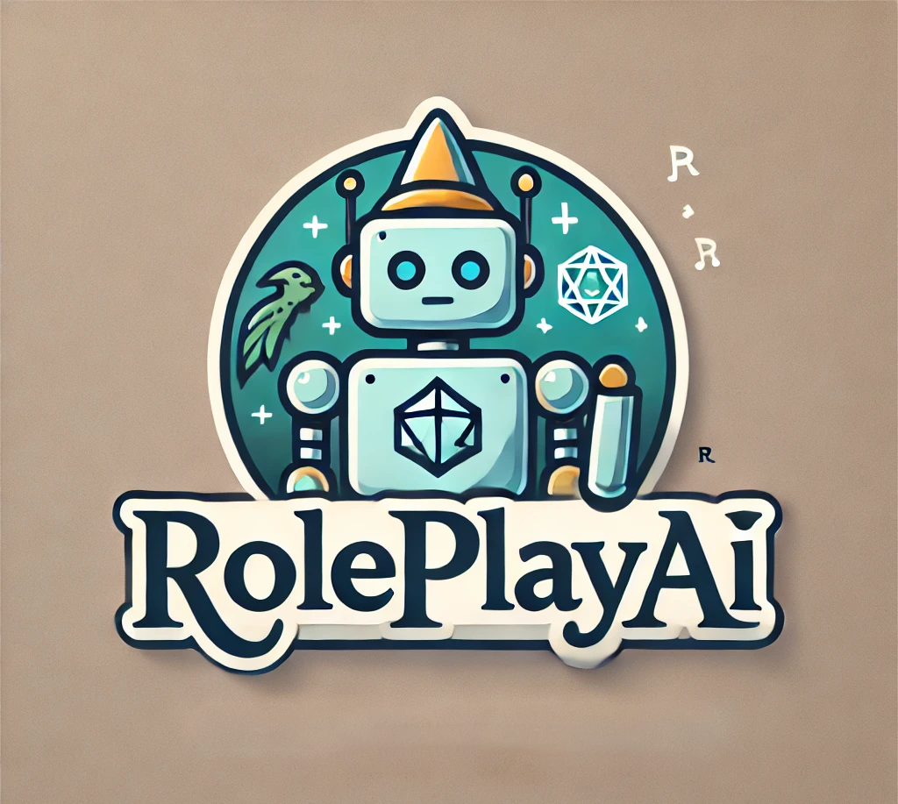

# RolePlayAI
---
## **Table of content**  

- [About](#about)
- [Features](#features)
- [Layout](#layout)
- [Dependencies](#dependencies)
- [Credits](#credits)

---

## <a id="about">**What is it?**</a>

**RolePlayAI** - is a simple tool for DnD like games, where users can create chatbots to talk with during the game. When you create a character - it will appear on your list, and you can talk to it!  

---

## <a id="features">**Features**</a>

- **Character Creation System**
    - *RolePlayAI's* main goal is to create characters that everyone can talk to. Our characters creation system allows users to easily create characters by just giving them names, age, positive and negative traits, and describing their story.  
- **Gigax's LLM model**
    - *RolePlayAI* is using Gigax's NPC-LLM-7B model to imitate characters. This model showed good results in making bots for roleplay games.
- **Multiple Languge Support**
    - *RolePlayAI* was implemented keeping in mind that people who does not speak English might want to use something like this in future. That is why we added support for multiple languages! To add desired language you just need to add a similar to ours .json file with the translation.

---

## <a id="layout">**Layout**</a>

- **Main Menu**
    - You can access the main menu by just opening the application.
    - From the main menu you can go to chat with bots that you have by clicking on **CHAT** button.
    - From the main menu you can manage your characters by clicking on **CHARACTERS** button.
    - From the main menu you can manage your settings by clicking on **SETTINGS** button.
    - Finally, you can exit the application by 
- **Chat Menu**
    - You can access chat menu by clicking on **CHAT** button in the main menu.
    - It forces you to choose a character to talk with.
    - After you choose your character, it will guide you to the chat page.
- **Chat Page**
    - You can chat with your character on this page.
- **Characters Menu**
    - You can access characters menu by clicking on **CHARACTERS** button in the main menu.
    - You can manage your characters in two ways:
        - **ADD** button provides you the oportunity to create a character and add it to your list.
        - **DELETE** buttons take their place right next to your characters, and allows you to delete them.
- **Characters Creation Menu**
    - You can access characters creation menu by clicking on **ADD** button in characters menu.
    - You can create you character on this page, giving it different information:
        1. *Name*
        2. *Age*
        3. *Positive Traits*
        4. *Negative Traits*
        5. *Lore*

---

## <a id="dependencies">**Dependencies**</a>
- This application requires you to install PyQT utiulity to use the interface.
- This application requires you to download torch and transformers utilities to use it's features.
- This application requires you to download the Gigax's NPC model (which will happen one time when first login).

---

## <a id="credits">**Credits**</a>

This project is maintained by two students at Boston University:  
- ***Aleksei Glebov : aglebov@bu.edu***
- ***Edison Tom : edisont@bu.edu***
